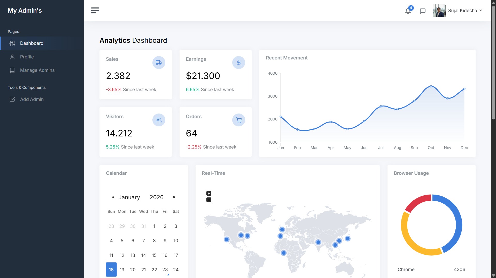
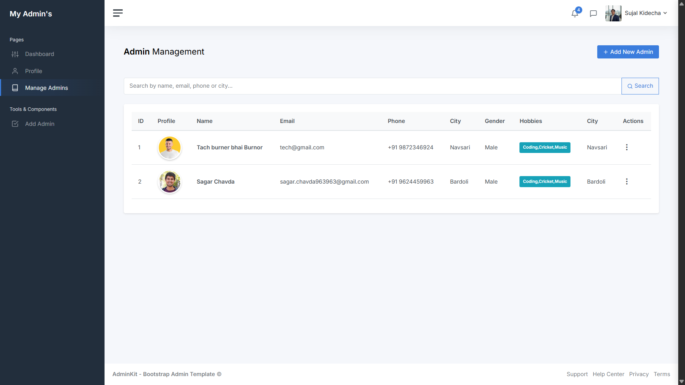
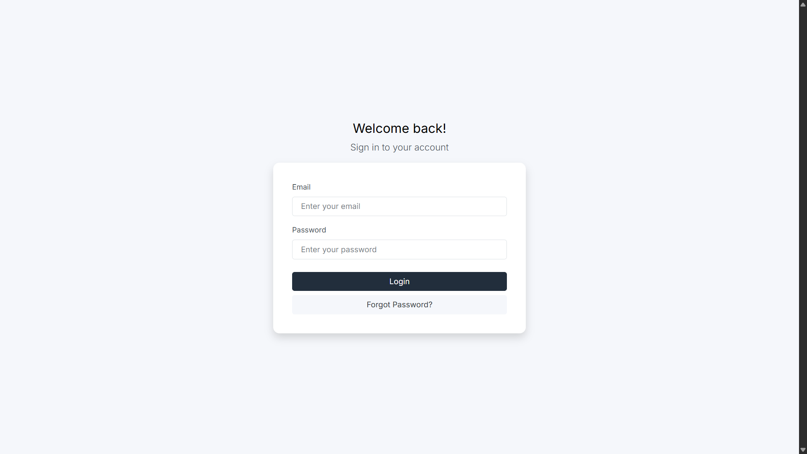

<div align="center">

# 🎯 Admin Panel - Complete CRUD Management System

[](https://nodejs.org/)
[](https://expressjs.com/)
[](https://www.mongodb.com/)
[](https://ejs.co/)

**A powerful, feature-rich admin panel built with Node.js, Express, MongoDB, and EJS templating engine.**

[Features](#-features) • [Installation](#-installation) • [Usage](#-usage) • [API Routes](#-api-routes) • [Project Structure](#-project-structure) • [Technologies](#-technologies-used)

</div>

---

## 📋 Table of Contents

- [Overview](#-overview)
- [Features](#-features)
- [Technologies Used](#-technologies-used)
- [Prerequisites](#-prerequisites)
- [Installation](#-installation)
- [Configuration](#-configuration)
- [Usage](#-usage)
- [Project Structure](#-project-structure)
- [API Routes](#-api-routes)
- [Database Schema](#-database-schema)
- [Authentication & Security](#-authentication--security)
- [Screenshots](#-screenshots)
- [Contributing](#-contributing)
- [License](#-license)

---

## 🌟 Overview

This **Admin Panel** is a full-stack web application designed for managing administrative users with complete CRUD (Create, Read, Update, Delete) operations. Built using the **MVC (Model-View-Controller)** architecture pattern, it provides a robust and scalable solution for user management.

The application features secure authentication, profile management, password recovery, email verification with OTP, and file upload capabilities for admin profiles.

---

## ✨ Features

### 🔐 **Authentication & Security**
- ✅ Secure login system with cookie-based sessions
- ✅ Email verification with OTP (One-Time Password)
- ✅ Forgot password functionality
- ✅ Password change capability
- ✅ Protected routes with authentication middleware
- ✅ Automatic logout functionality

### 👥 **Admin Management**
- ✅ View all admins in a comprehensive dashboard
- ✅ Add new admin users with detailed information
- ✅ Edit existing admin profiles
- ✅ Delete admin users
- ✅ Profile picture upload with Multer
- ✅ Personal profile page for logged-in admins

### 📊 **Dashboard Features**
- ✅ Interactive admin dashboard
- ✅ Real-time data visualization
- ✅ User statistics and analytics
- ✅ Responsive design for all devices

### 📧 **Email Integration**
- ✅ Email notifications using Nodemailer
- ✅ OTP verification for security
- ✅ Password reset emails

---

## 🛠 Technologies Used

### **Backend**
| Technology | Version | Purpose |
|------------|---------|---------|
| **Node.js** | Latest | JavaScript runtime environment |
| **Express.js** | ^5.2.1 | Web application framework |
| **MongoDB** | Latest | NoSQL database |
| **Mongoose** | ^9.1.1 | MongoDB object modeling |

### **Frontend**
| Technology | Version | Purpose |
|------------|---------|---------|
| **EJS** | ^3.1.10 | Templating engine |
| **CSS3** | - | Styling |
| **JavaScript** | ES6+ | Client-side scripting |

### **Additional Packages**
| Package | Version | Purpose |
|---------|---------|---------|
| **Multer** | ^2.0.2 | File upload handling |
| **Nodemailer** | ^7.0.12 | Email sending |
| **Cookie-Parser** | ^1.4.7 | Cookie parsing middleware |
| **Nodemon** | ^3.1.11 | Development auto-restart |

---

## 📦 Prerequisites

Before you begin, ensure you have the following installed:

- **Node.js** (v14 or higher) - [Download](https://nodejs.org/)
- **MongoDB** (v4.4 or higher) - [Download](https://www.mongodb.com/try/download/community)
- **npm** or **yarn** package manager
- A code editor (VS Code recommended)

---

## 🚀 Installation

Follow these steps to set up the project locally:

### 1️⃣ **Clone the Repository**
```bash
git clone <your-repository-url>
cd "11 Admin Penel"
```

### 2️⃣ **Install Dependencies**
```bash
npm install
```

This will install all required packages:
- express
- mongoose
- ejs
- multer
- nodemailer
- cookie-parser
- nodemon

### 3️⃣ **Set Up MongoDB**

Make sure MongoDB is running on your system:

**Windows:**
```bash
mongod
```

**macOS/Linux:**
```bash
sudo systemctl start mongod
```

The application will automatically create a database named `Admin-Penel` on `mongodb://localhost:27017`.

### 4️⃣ **Create Upload Directory**

The application uses the `upload/admin` directory for storing profile pictures. It will be created automatically, but you can create it manually:

```bash
mkdir -p upload/admin
```

---

## ⚙️ Configuration

### **Database Configuration**

The database configuration is located in `config/db.config.js`:

```javascript
const URI = 'mongodb://localhost:27017/Admin-Penel';
```

You can modify this URI to point to your MongoDB instance or use MongoDB Atlas for cloud hosting.

### **Server Configuration**

The server runs on port **6800** by default. You can change this in `server.js`:

```javascript
const port = 6800;
```

### **Email Configuration**

To enable email functionality (OTP, password reset), configure Nodemailer in your controller with your SMTP settings.

---

## 🎮 Usage

### **Start the Development Server**

```bash
npm start
```

This will start the server with **Nodemon**, which automatically restarts on file changes.

### **Access the Application**

Open your browser and navigate to:

```
http://localhost:6800
```

### **Default Login**

You'll need to create your first admin user through the registration process or directly in MongoDB.

---

## 📁 Project Structure

```
11 Admin Penel/
│
├── config/
│   └── db.config.js          # Database configuration
│
├── controller/
│   └── admin.controller.js   # Admin business logic
│
├── model/
│   └── admin.model.js        # Admin schema definition
│
├── routes/
│   └── index.js              # Application routes
│
├── views/
│   ├── auth/                 # Authentication views
│   │   ├── login.ejs
│   │   ├── otp.ejs
│   │   ├── forgotPassword.ejs
│   │   └── changePassword.ejs
│   ├── Profile/
│   │   └── profile.ejs       # User profile page
│   ├── dashboard.ejs         # Main dashboard
│   ├── viewAdmin.ejs         # View all admins
│   ├── addAdmin.ejs          # Add new admin
│   ├── editAdmin.ejs         # Edit admin
│   ├── header.ejs            # Header component
│   └── footer.ejs            # Footer component
│
├── public/
│   ├── css/                  # Stylesheets
│   ├── js/                   # Client-side scripts
│   └── img/                  # Images
│
├── upload/
│   └── admin/                # Uploaded profile pictures
│
├── node_modules/             # Dependencies
├── package.json              # Project metadata
├── package-lock.json         # Dependency lock file
├── server.js                 # Application entry point
└── README.md                 # This file
```

---

## 🛣 API Routes

### **Public Routes** (No Authentication Required)

| Method | Route | Description |
|--------|-------|-------------|
| `GET` | `/` | Login page |
| `POST` | `/login` | Handle login |
| `GET` | `/Otp-Page` | OTP verification page |
| `POST` | `/VerifyOtp` | Verify OTP |
| `GET` | `/forgot-pass` | Forgot password page |
| `POST` | `/forgot-pass` | Handle password reset |
| `POST` | `/verify-email` | Verify email for registration |

### **Protected Routes** (Authentication Required)

| Method | Route | Description |
|--------|-------|-------------|
| `GET` | `/dashboard` | Admin dashboard |
| `GET` | `/viewAdmin` | View all admins |
| `GET` | `/addAdmin` | Add admin page |
| `POST` | `/addAdmin` | Create new admin |
| `GET` | `/editAdmin/:id` | Edit admin page |
| `POST` | `/updateAdmin/:id` | Update admin |
| `GET` | `/deleteAdmin/:id` | Delete admin |
| `GET` | `/profile` | View own profile |
| `GET` | `/change-password` | Change password page |
| `POST` | `/change-password` | Update password |
| `GET` | `/logout` | Logout user |

---

## 🗄 Database Schema

### **Admin Model**

```javascript
{
  profile: String,      // Profile picture path
  fname: String,        // First name
  lname: String,        // Last name
  email: String,        // Email address (unique)
  password: String,     // Hashed password
  phone: Number,        // Phone number
  gander: String,       // Gender
  hobby: Array,         // Array of hobbies
  city: String,         // City
  about: String         // About/Bio
}
```

---

## 🔒 Authentication & Security

### **Cookie-Based Sessions**
- User authentication is managed through cookies
- Cookie name: `adminId`
- Stores the MongoDB `_id` of the logged-in admin

### **Authentication Middleware**
```javascript
checkAdminAuth(req, res, next)
```
- Verifies cookie existence
- Validates admin in database
- Attaches admin object to request
- Redirects to login if unauthorized

### **File Upload Security**
- Profile pictures stored in `upload/admin/`
- Filename format: `timestamp-originalname`
- Handled by Multer middleware

---

## 📸 Screenshots

> **Note:** Add screenshots of your application here to showcase the UI/UX.

### Dashboard


### Admin Management


### Login Page


---

## 🤝 Contributing

Contributions are welcome! Here's how you can help:

1. **Fork** the repository
2. **Create** a new branch (`git checkout -b feature/AmazingFeature`)
3. **Commit** your changes (`git commit -m 'Add some AmazingFeature'`)
4. **Push** to the branch (`git push origin feature/AmazingFeature`)
5. **Open** a Pull Request

---

## 📄 License

This project is licensed under the **ISC License**.

---

## 👨‍💻 Author

**Sujal**

- GitHub: [@sujal68](https://github.com/sujal68)
- Email: sujalkidecha68@gmail.com

---

## 🙏 Acknowledgments

- **Express.js** for the robust web framework
- **MongoDB** for the flexible database
- **EJS** for the powerful templating engine
- **Multer** for seamless file uploads
- **Nodemailer** for email functionality

---

## 📞 Support

If you have any questions or need help, feel free to:

- Open an issue on GitHub
- Contact via email
- Check the documentation

---

<div align="center">

### ⭐ If you find this project useful, please consider giving it a star!

**Made with ❤️ by Sujal**

</div>
