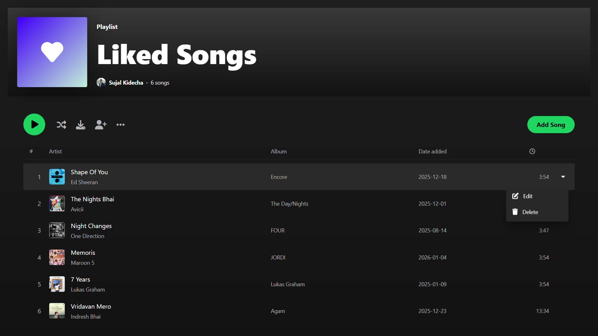
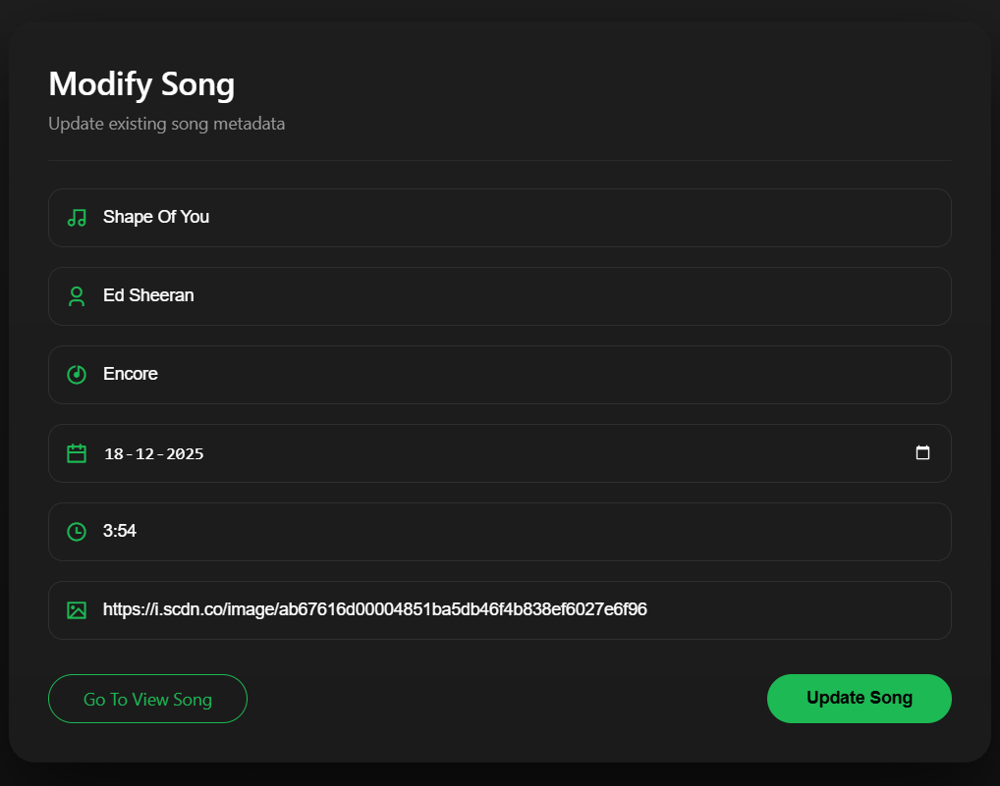
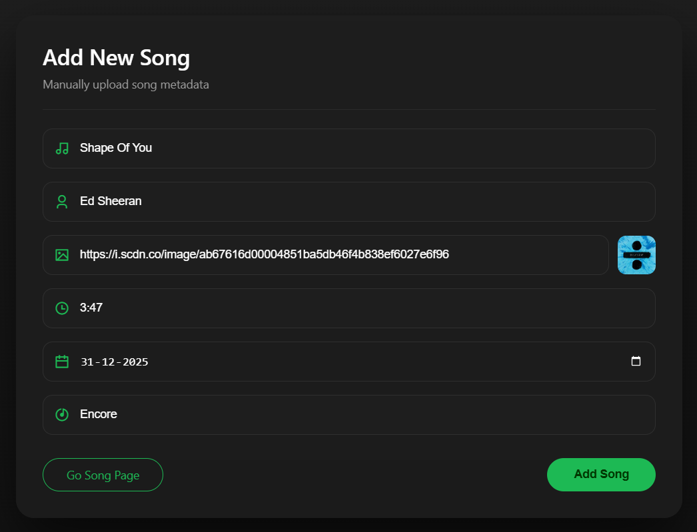

# 🎵 Music CRUD Project (Node.js + Express + MongoDB)

A **full-stack CRUD application** built using **Node.js, Express, MongoDB (Mongoose), and EJS**, designed to manage music/song metadata with a clean Spotify-inspired UI.

This project demonstrates **real-world backend fundamentals**, MVC-style structure, database operations, and server-side rendering — ideal for **college submission and backend learning**.

---

## 📌 Features

- ➕ Add new songs with complete metadata  
- 📄 View all songs in a playlist-style layout  
- ✏️ Edit existing song details  
- 🗑️ Delete songs instantly  
- 📊 Dynamic total song count  
- 🖼️ Live image preview using image URL  
- 🎨 Clean & modern UI (Spotify-inspired)  
- 🗄️ MongoDB integration using Mongoose  
- ⚡ Fast server-side rendering with EJS  

---

## 🛠️ Tech Stack

**Frontend**
- EJS (Template Engine)
- HTML5
- CSS3
- Bootstrap 5
- Remix Icons / Font Awesome

**Backend**
- Node.js
- Express.js

**Database**
- MongoDB (Local)
- Mongoose ODM

**Tools**
- Nodemon

---
## 📁 Project Structure

```
CRUD PROJECT
│
├── config/
│   └── db.config.js
│
├── model/
│   └── song.model.js
│
├── public/
│   └── dist/
│       └── style.css
│
├── Views/
│   ├── song.ejs
│   ├── songAddPage.ejs
│   └── editSong.ejs
│
├── ReadmeImg/
│   ├── SongView.png
│   ├── addSong.png
│   └── editSong.png
│
├── server.js
├── package.json
├── package-lock.json
└── README.md
```


---

## 🖼️ Project Screenshots

### 🎶 Song List View


### ➕ Add Song Page


### ✏️ Edit Song Page


---

## 📦 Song Data Model

Each song contains the following fields:

- `songTitle` – Song name  
- `songAuth` – Artist name  
- `songAlbum` – Album name  
- `songAddDate` – Date added  
- `songDuration` – Song length (mm:ss)  
- `songImg` – Cover image URL  

---

## 🚀 Installation & Setup

### 1️⃣ Clone the Repository
```bash
git clone <repository-url>
cd crud-project
```

### 2️⃣ Install Dependencies
```bash
npm install
```

### 3️⃣ Start MongoDB
Make sure MongoDB is running locally:
```bash
mongodb://localhost:27017/Music-Opretion
```

### 4️⃣ Run the Server
```bash
npm start
```

### 5️⃣ Open in Browser
```
http://localhost:6800
```

---

## 🔗 Routes Overview

| Method | Route | Description |
|--------|-------|-------------|
| GET | `/` | View all songs |
| GET | `/songAddPage` | Add song page |
| POST | `/addSong` | Save new song |
| GET | `/SongEdit/:SongId` | Edit song page |
| POST | `/songUpdate` | Update song |
| GET | `/SongDelete/:SongId` | Delete song |

---

## 📚 Learning Outcomes

- MVC-style project structure
- CRUD operations using MongoDB
- Express routing & middleware
- Server-side rendering with EJS
- Handling forms & URL parameters
- Real-world backend workflow
- Clean UI + backend integration

🧑‍🎓 Author
Sujal Kidecha
BCA Student | Backend Learner
MongoDB • Express • Node.js

📜 License
This project is licensed under the MIT License.

✔️ Allowed for learning and reference

✔️ Credit is mandatory

❌ Direct copying for submission is discouraged

© 2025 Sujal Kidecha. All rights reserved.